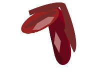
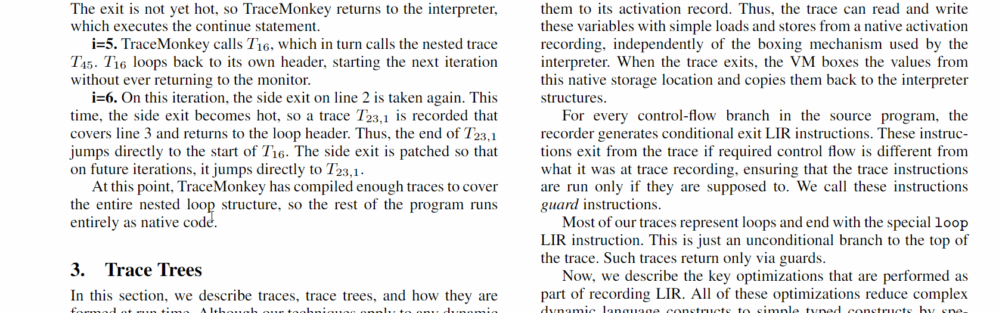
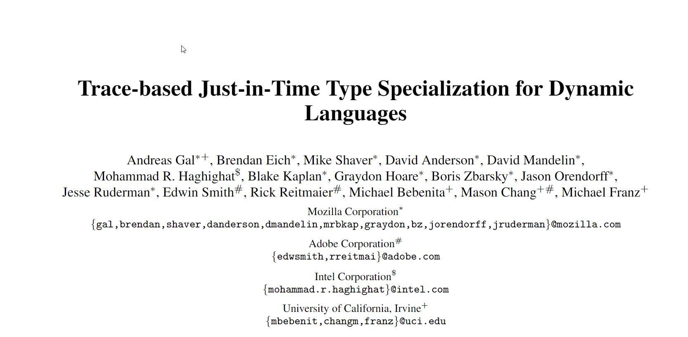

# Stallion  

Stallion is an extended PDF viewer based on <a href="https://mozilla.github.io/pdf.js/">PDF.js</a>. 
It provides researchers with tools that make paper reading simpler. Some features include intuitive peeking routines for definition review, better handling of references and adding shorcuts to arbitrary locations in the document. 

 
 
 
 

You can play around with our demo!

You can also visit us on our website: 

If you are experiencing trouble, please let us know.

Help us! [Contribute](#contributing)

**Note**: We are not affiliated with Mozilla. We share nothing apart from keen appreciation for the open source community.
None of our actions reflects on them.

## Features
In addition to all the amazing features in PDF.js, here are some more.

### The Slash Bar
With simplicity as a core principle in Stallion, we introduce the (*soon to be famous*) **Slash Bar** (triggered by pressing `/` anywhere in the document). 
The slash bar allows you to type commands instead of using on-screen buttons. 

#### Basic

* `outline` - Toggle document's outline (if exists).
* `toolbar` - Toggle PDF.js-derived toolbar (hidden by default).

* `back` - Go back.
* `page`*`number`* - Go to page.
* `zoom in/out [`*`digit`*`]` - Zoom. *digit* is optional. If specified, determines iterates the operation *digit* times.

#### Navigation
* `shortcut/name/dub`*`name`* - Set shortcut to current location in document.
* `jump`*`name`* - Go to shortcut.  
* `fgoto`*`SearchPhrase`* - Find next occurence of the search phrase. You are advised to use the find bar instead (`Ctrl+F`).
*  `fpeek`*`SearchPhrase`* - Opens a Peek Box for the search phrase.

Note: Typing wrong commands can get offensive.

### Peek Box
The Peek Box is used as a substitute for the standard find operation. 
It allows you to peek at different locations without leaving the current.
Ideally, it should allow you to review definitions, references, theorems, and other parts of the document without the burden of context switching.

### Double Slash: experimental
Select text and double-click `/`. This will invoke a double slash operation. It serves several purposes

#### 1. Peek at selection
In its most naive use, it will just `fpeek` the selected text. 
If the selection follows certain patterns, it is supposed to present some more advanced behavior (*intelligent peeking*) which is still under active development.

#### 2. Reference Resolution (preliminary)
If the reference trigger is fired (As of now, this happens if the selection has more than 20 characters), a reference summary box will appear. This summary includes: Title, URL, reference count and citation count. As of now, the resolution is still handled poorly. Plus, even if the right article is found,  data isn't always correct.

#### 3. Quick fpeek 
If no text is selected, the slash bar is opened, waiting for a keyword for `fpeek`.

## Getting the Code

To get a local copy of the current code, clone it using git:

    $ git clone https://github.com/guyd1995/stallion.git
    $ cd stallion

Next, install Node.js via the [official package](https://nodejs.org) or via
[nvm](https://github.com/creationix/nvm). You need to install the gulp package
globally (see also [gulp's getting started](https://github.com/gulpjs/gulp/blob/master/docs/getting-started.md#getting-started)):

    $ npm install -g gulp-cli

If everything worked out, install all dependencies for PDF.js:

    $ npm install

Finally, you need to start a local web server as some browsers do not allow opening
PDF files using a `file://` URL. Run:

    $ gulp server

and then you can open:

+ http://localhost:8888/web/viewer.html

Please keep in mind that this requires an ES6 compatible browser; refer to [Building PDF.js](https://github.com/mozilla/pdf.js/blob/master/README.md#building-pdfjs) for usage with older browsers.

It is also possible to view all test PDF files on the right side by opening:

+ http://localhost:8888/test/pdfs/?frame

### Building Stallion Extensions from Scratch

To generate the browser extension from the code, run:

    $ gulp chromium

It generates a Chrome extension, but it can be exported to Firefox as is.

## PDF.js
[PDF.js](https://mozilla.github.io/pdf.js/) is a Portable Document Format (PDF) viewer that is built with HTML5.

PDF.js is community-driven and supported by Mozilla Labs. Their goal is to
create a general-purpose, web standards-based platform for parsing and
rendering PDFs.

Please, visit their [repository](https://github.com/mozilla/pdf.js) for additional information.
 

## Contributing

We base our contribution guidelines on those of PDF.js. Also, recall we build upon their code base and utilize changes in their repository. All in all, you are very much encouraged to contribute to PDF.js. We advise you to take a glance at their code contribution guide (see below).

* [Issue Reporting Guide](https://github.com/guyd1995/stallion/blob/master/.github/CONTRIBUTING.md)
* [Future Work](https://github.com/guyd1995/stallion/wiki/Future-Work)

* PDF.js
	* [Code Contribution Guide](https://github.com/mozilla/pdf.js/wiki/Contributing)
	* [Frequently Asked Questions](https://github.com/mozilla/pdf.js/wiki/Frequently-Asked-Questions)
	* [Good Beginner Bugs](https://github.com/mozilla/pdf.js/issues?direction=desc&labels=5-good-beginner-bug&page=1&sort=created&state=open)

