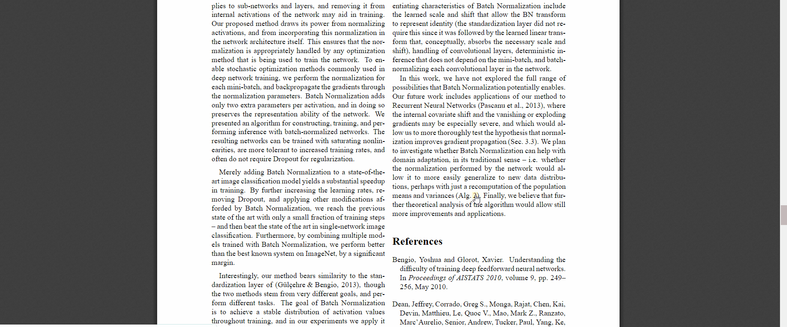
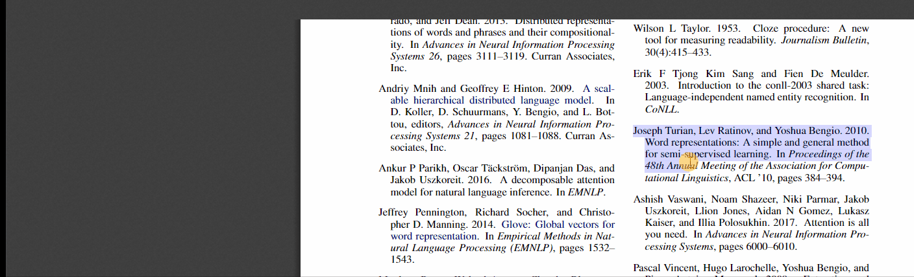

# Stallion  

Stallion is an extended PDF viewer based on <a href="https://mozilla.github.io/pdf.js/">PDF.js</a>. 
It provides researchers with tools that make paper reading simpler. Some features include intuitive peeking routines for definition review, better handling of references and adding shorcuts to arbitrary locations in the document. 

 
 
 
 

You can play around with our demo!

You can also visit us on our website: 

For installation instructions click here:

If you are experiencing trouble, please let us know.

Help us! [Contribute](#contributing)

**Note**: We are not affiliated with Mozilla. We share nothing apart from keen appreciation for the open source community.
None of our actions reflects on them.

## Overview
Our goal is to maximize research productivity. We try to make a user-friendly PDF viewer with extra features that are: **intuitive**, **useful** and **configurable** with little effort. 
There is no need to learn how to use the viewer. 
You can just use it like any other viewer. However, the viewer will react differently, (hopefully) in a more intuitive way. 
Some key features of the viewer (we are still halfway through):
* **Links**: We replace internal links with split view peekers that show you the requested page along with the original page.
* **Reference Metadata & Abstract**: Presenting article metadata and abstract for articles for references in the document.
* **"Remind" boxes**: Identifies mentions of defintions, theorems, references in the document and so on, and provides a reminder from their location in the document. 

## Basic Features
### Internal Links
When clicking on internal links, the will *not* jump to the requested position. Instead, the requested page will be presented on the side for convenient review.

### References
Select a reference and double click `/` (slash). If it is identified as a reference by Stallion, it will try to resolve it in two steps:
1. Stallion will send a request to [CrossRef](https://www.crossref.org/). If the reference was identified correctly Stallion will present article metadata.

* After metadata was extracted, Stallion sends a request to [Semantic Scholar](https://www.semanticscholar.org/). If the record is found, an abstract will soon appear.

## Advanced Features (under construction)
Together with the above mentioned tweaks, we provide extra features for even better experience that require (very little) introduction.

### The Slash Bar
With simplicity as a core principle in Stallion, we introduce the (*soon to be famous*) **Slash Bar** (triggered by pressing `/` anywhere in the document). 
The slash bar allows you to type commands instead of using on-screen buttons. 

#### Basic

* `outline` - Toggle document's outline (if exists).
* `toolbar` - Toggle PDF.js-derived toolbar (hidden by default).

* `back` - Go back.
* `page`*`number`* - Go to page.
* `zoom in/out [`*`digit`*`]` - Zoom. *digit* is optional. If specified, determines iterates the operation *digit* times.

#### Navigation
* `shortcut/name/dub`*`name`* - Set shortcut to current location in document.
* `jump`*`name`* - Go to shortcut.  
* `fgoto`*`SearchPhrase`* - Find next occurence of the search phrase. You are advised to use the find bar instead (`Ctrl+F`).
*  `fpeek`*`SearchPhrase`* - Opens a Peek Box for the search phrase.

Note: Typing wrong commands can get offensive.

## Getting the Code

To get a local copy of the current code, clone it using git:

    $ git clone https://github.com/guyd1995/stallion.git
    $ cd stallion

Next, install Node.js via the [official package](https://nodejs.org) or via
[nvm](https://github.com/creationix/nvm). You need to install the gulp package
globally (see also [gulp's getting started](https://github.com/gulpjs/gulp/blob/master/docs/getting-started.md#getting-started)):

    $ npm install -g gulp-cli

If everything worked out, install all dependencies for PDF.js:

    $ npm install

Finally, you need to start a local web server as some browsers do not allow opening
PDF files using a `file://` URL. Run:

    $ gulp server

and then you can open:

+ http://localhost:8888/web/viewer.html

Please keep in mind that this requires an ES6 compatible browser; refer to [Building PDF.js](https://github.com/mozilla/pdf.js/blob/master/README.md#building-pdfjs) for usage with older browsers.

It is also possible to view all test PDF files on the right side by opening:

+ http://localhost:8888/test/pdfs/?frame

### Building Stallion Extensions from Scratch

To generate the browser extension from the code, run:

    $ gulp chromium

It generates a Chrome extension, but it can be exported to Firefox as is.

## PDF.js
[PDF.js](https://mozilla.github.io/pdf.js/) is a Portable Document Format (PDF) viewer that is built with HTML5.

PDF.js is community-driven and supported by Mozilla Labs. Their goal is to
create a general-purpose, web standards-based platform for parsing and
rendering PDFs.

Please, visit their [repository](https://github.com/mozilla/pdf.js) for additional information.
 

## Contributing

We base our contribution guidelines on those of PDF.js. Also, recall we build upon their code base and utilize changes in their repository. All in all, you are very much encouraged to contribute to PDF.js. We advise you to take a glance at their code contribution guide (see below).

* [Issue Reporting Guide](https://github.com/guyd1995/stallion/blob/master/.github/CONTRIBUTING.md)
* [Future Work](https://github.com/guyd1995/stallion/wiki/Future-Work)

* PDF.js
	* [Code Contribution Guide](https://github.com/mozilla/pdf.js/wiki/Contributing)
	* [Frequently Asked Questions](https://github.com/mozilla/pdf.js/wiki/Frequently-Asked-Questions)
	* [Good Beginner Bugs](https://github.com/mozilla/pdf.js/issues?direction=desc&labels=5-good-beginner-bug&page=1&sort=created&state=open)

